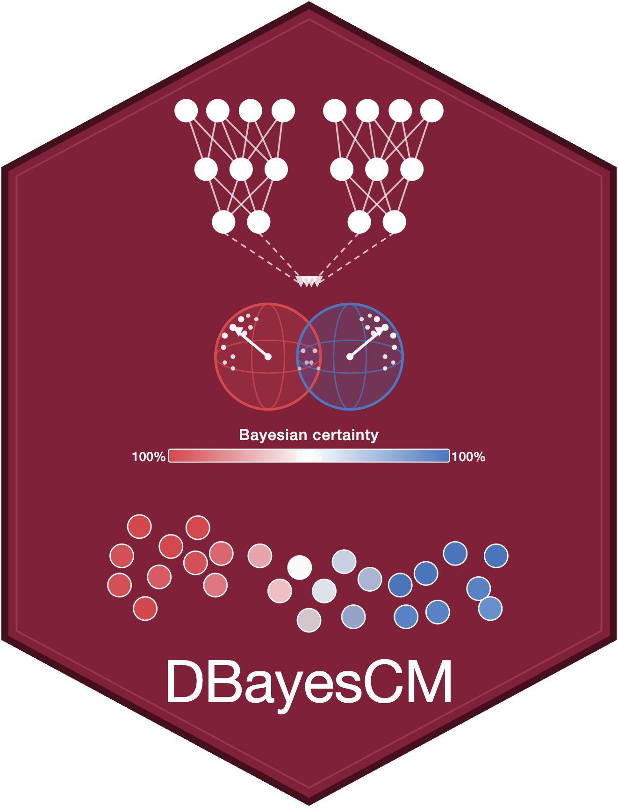
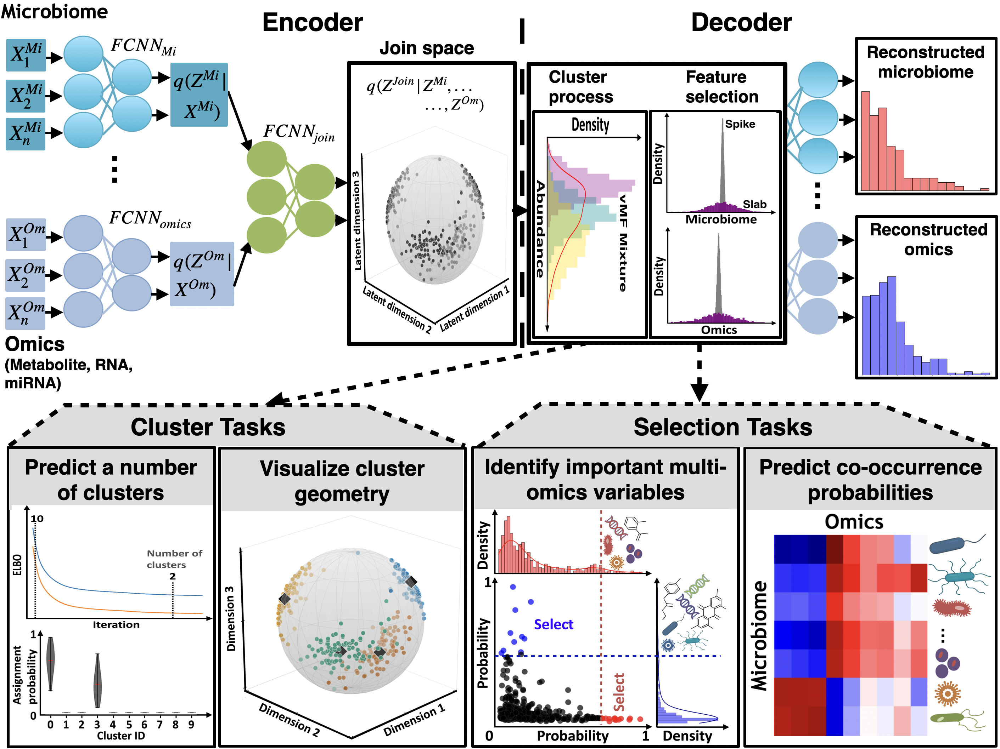

<table border="0">
  <tr>
    <td>
      
    </td>
    <td>
      <h1>DBayesCM</h1>
      <h3>Dang, T., Lysenko, A., & Tsunoda, T. (2026). bioRxiv, 2026-08. doi: https://doi.org/10.64898/2026.07.28.741374</h3>
    </td>
  </tr>
</table>

## The workflow of DBayesCM

